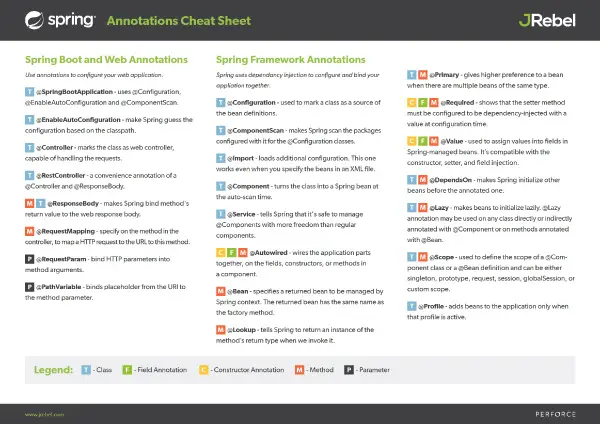

# Read Me First
The following was discovered as part of building this project:

* The JVM level was changed from '11' to '17', review the [JDK Version Range](https://github.com/spring-projects/spring-framework/wiki/Spring-Framework-Versions#jdk-version-range) on the wiki for more details.

# Getting Started

### Reference Documentation
For further reference, please consider the following sections:

* [Official Apache Maven documentation](https://maven.apache.org/guides/index.html)
* [Spring Boot Maven Plugin Reference Guide](https://docs.spring.io/spring-boot/docs/3.0.0-SNAPSHOT/maven-plugin/reference/html/)
* [Create an OCI image](https://docs.spring.io/spring-boot/docs/3.0.0-SNAPSHOT/maven-plugin/reference/html/#build-image)
* [Spring Web](https://docs.spring.io/spring-boot/docs/2.6.3/reference/htmlsingle/#boot-features-developing-web-applications)
* [Spring Data JPA](https://docs.spring.io/spring-boot/docs/2.6.3/reference/htmlsingle/#boot-features-jpa-and-spring-data)

### Guides
The following guides illustrate how to use some features concretely:

* [Building a RESTful Web Service](https://spring.io/guides/gs/rest-service/)
* [Serving Web Content with Spring MVC](https://spring.io/guides/gs/serving-web-content/)
* [Building REST services with Spring](https://spring.io/guides/tutorials/bookmarks/)
* [Accessing Data with JPA](https://spring.io/guides/gs/accessing-data-jpa/)
* [Accessing data with MySQL](https://spring.io/guides/gs/accessing-data-mysql/)

---
---

# Some Helpful Things

## Merge MAIN with USER branch on a daily basis

```bash
git checkout <user branch name>      # gets you "on branch "
git fetch origin        # gets you up to date with origin
git merge origin/main

```

---
---

## Dos2Unix OR Unix2Dos

unix2dos is a tool to convert line breaks in a text file from Unix format (Line feed) to DOS format (carriage return + Line feed) `"\r"` and vice versa.

```bash
# dos2unix command : converts a DOS text file to UNIX format.
dos2unix <file_name>
# Unix2dos command : converts a Unix text file to DOS format
unix2dos <file_name>
```

---
---

## How to Change the Default Port in Spring Boot

1. Overview

    Spring Boot provides sensible defaults for many configuration properties. But we sometimes need to customize these with our case-specific values.

    And a common use case is changing the default port for the embedded server.

    In this quick tutorial, we'll cover several ways to achieve this.

2. Using `Property Files`

    The fastest and easiest way to customize Spring Boot is by overriding the values of the default properties.

    For the server port, the property we want to change is server.port.

    By default, the embedded server starts on port 8080.

    So, let's see how to provide a different value in an `application.properties` file:

    ```gradle
    server.port=8081
    ```

    Now the server will start on port 8081.

    And we can do the same if we're using an application.yml file:

    ```yaml
    server:
        port : 8081
    ```

    Both files are loaded automatically by Spring Boot if placed in the src/main/resources directory of a Maven application.

3. Environment-Specific Ports

    If we have an application deployed in different environments, we may want it to run on different ports on each system.

    We can easily achieve this by combining the property files approach with Spring profiles. Specifically, we can create a property file for each environment.

    For example, we'll have an `application-dev.properties` file with this content:

    ```gradle
    server.port=8081
    ```

    Then we'll add another `application-qa.properties` file with a different port:

    ```gradle
    server.port=8082
    ```

    Now, the property files configuration should be sufficient for most cases. However, there are other options for this goal, so let's explore them as well.

3. Programmatic Configuration

    We can configure the port programmatically either by setting the specific property when starting the application or by customizing the embedded server configuration.

    First, let's see how to set the property in the main 
    
    ```java
    @SpringBootApplication class:

    @SpringBootApplication
    public class CustomApplication {
        public static void main(String[] args) {
            SpringApplication app = new SpringApplication(CustomApplication.class);
            app.setDefaultProperties(Collections
            .singletonMap("server.port", "8083"));
            app.run(args);
        }
    }
    ```

    Next, to customize the server configuration, we have to implement the WebServerFactoryCustomizer interface:

    ```java
    @Component
    public class ServerPortCustomizer 
    implements WebServerFactoryCustomizer<ConfigurableWebServerFactory> {
    
        @Override
        public void customize(ConfigurableWebServerFactory factory) {
            factory.setPort(8086);
        }
    }
    ```

    Note that this applies to the Spring Boot 2.x version.

    For Spring Boot 1.x, we can similarly implement the EmbeddedServletContainerCustomizer interface.

4. Using `Command-Line Arguments`
    When packaging and running our application as a jar, we can set the server.port argument with the java command:
    
    ```java
    java -jar spring-5.jar --server.port=8083
    ```

    or by using the equivalent syntax:

    ```java
    java -jar -Dserver.port=8083 spring-5.jar
    ```

5. Order of Evaluation

    As a final note, let's look at the order in which these approaches are evaluated by Spring Boot.

    Basically, the configurations priority is

    - embedded server configuration
    - command-line arguments
    - property files
    - main @SpringBootApplication configuration

---
---

## Java Multiline String Format

1. Text Blocks
    We can use Text Blocks by declaring the string with  `""" (three double-quote marks)`:
    
    It is, by far, the most convenient way to declare a multi-line string. Indeed, we don't have to deal with line separators or indentation spaces, as we can read in our dedicated article.

    **Note: `This feature is available in Java 15, but also Java 13 and 14 if we enable the preview feature`.**

    ```java
    public String textBlocks() {
        return """
            <table>
                <tr>
                    <th>Company</th>
                    <th>Contact</th>
                    <th>Country</th>
                </tr>
                <tr>
                    <td>Alfreds Futterkiste</td>
                    <td>Maria Anders</td>
                    <td> Germany</td>
                </tr>
                <tr>
                    <td>Centro comercial Moctezuma</td>
                    <td>Francisco Chang</td>
                    <td>Mexico</td>
                </tr>
            </table>""";
    }
    ```

2. Getting the Line Separator

    Each operating system can have its own way of defining and recognizing new lines. In Java, it's very easy to get the operating system line separator:

    ```java
    String newLine = System.getProperty("line.separator");
    ```

3. String Concatenation

    String concatenation is an easy native method which can be used to create multi-line strings:

    ```java
    public String stringConcatenation() {
        return "Get busy living"
                .concat(newLine)
                .concat("or")
                .concat(newLine)
                .concat("get busy dying.")
                .concat(newLine)
                .concat("--Stephen King");
    }
    ```

    Using the + operator is another way of achieving the same thing. Java compilers translate concat() and the + operator in the same way:

    ```java
    public String stringConcatenation() {
        return "Get busy living"
                + newLine
                + "or"
                + newLine
                + "get busy dying."
                + newLine
                + "--Stephen King";
    }
    ```

4. String Join

    Java 8 introduced String#join, which takes a delimiter along with some strings as arguments. It returns a final string having all input strings joined together with the delimiter:

    ```java
    public String stringJoin() {
        return String.join(newLine,
                        "Get busy living",
                        "or",
                        "get busy dying.",
                        "--Stephen King");
    }
    ```

5. String Builder

    StringBuilder is a helper class to build Strings. StringBuilder was introduced in Java 1.5 as a replacement for StringBuffer. It's a good choice for building huge strings in a loop:

    ```java
    public String stringBuilder() {
        return new StringBuilder()
                .append("Get busy living")
                .append(newLine)
                .append("or")
                .append(newLine)
                .append("get busy dying.")
                .append(newLine)
                .append("--Stephen King")
                .toString();
    }
    ```

6. String Writer

    StringWriter is another method that we can utilize to create a multi-line string. We don't need newLine here, because we use PrintWriter. The println function automatically adds new lines:

    ```java
    public String stringWriter() {
        StringWriter stringWriter = new StringWriter();
        PrintWriter printWriter = new PrintWriter(stringWriter);
        printWriter.println("Get busy living");
        printWriter.println("or");
        printWriter.println("get busy dying.");
        printWriter.println("--Stephen King");
        return stringWriter.toString();
    }
    ```

7. Guava Joiner

    Using an external library just for a simple task like this doesn't make much sense, however, if the project already uses the library for other purposes, we can utilize it. For example, Google's Guava library is very popular. Guava has a Joiner class that is able to build multi-line strings:

    ```java
    public String guavaJoiner() {
        return Joiner.on(newLine).join(ImmutableList.of("Get busy living",
            "or",
            "get busy dying.",
            "--Stephen King"));
    }
    ```

9. Loading from a File

    Java reads files exactly as they are. This means that if we have a multi-line string in a text file, we'll have the same string when we read the file. There are a lot of ways to read from a file in Java.

    Actually, it's a good practice to separate long strings from code:

    Watch this new video for more information
    You may like this trending video
    
    ```java
    // You can also implement the IOException in a try{}catch{}finally block as well
    public String loadFromFile(String filePath) throws IOException {
        return new String(Files.readAllBytes(Paths.get(filePath)));
    }
    ```

    and now pass the file in to a string variable

    ```java
    public String someFile = loadFromFile("Some_File_Path_&_Name_abs_or_relative")
    ```

---
---

<div id="bodyContent" class="mw-body">
		<div id="siteSub">From Git SCM Wiki</div>
		<div id="contentSub"></div>
		<div id="jump-to-nav" class="mw-jump">Jump to: <a href="#column-one">navigation</a>, <a href="#searchInput">search</a></div>
		<!-- start content -->
<div id="mw-content-text" lang="en" dir="ltr" class="mw-content-ltr"><h1> <span class="mw-headline" id="Git_Submodule_Tutorial"> Git Submodule Tutorial </span></h1>
<p>Submodule support has been available in Git since version 1.5.3. This tutorial explains how to create and publish a repository with four submodules using the <a rel="nofollow" class="external text" href="http://www.kernel.org/pub/software/scm/git/docs/git-submodule.html">git-submodule(1)</a> command.
</p><p>Submodules maintain their own identity; the submodule support just stores the submodule repository location and commit ID, so other developers who clone the superproject can easily clone all the submodules at the same revision.
</p><p>For the purposes of the tutorial, the public repositories will be published under your home directory in ~/subtut/public. Let's create the four public submodule repositories first:
</p>
<pre>$ mkdir -p ~/subtut/private
$ mkdir -p ~/subtut/public
$ cd ~/subtut/private
$ for mod in a b c d; do
    mkdir $mod
    cd $mod
    git init
    echo "module $mod" &gt; $mod.txt
    git add $mod.txt
    git commit -m "Initial commit, public module $mod"
    git clone --bare . ~/subtut/public/$mod.git
    git remote add origin ~/subtut/public/$mod.git
    git config branch.master.remote origin
    git config branch.master.merge refs/heads/master
    cd ..
done
</pre>
<p>Now create the public superproject; we won't actually add the submodules yet.
</p>
<pre>$ cd ~/subtut/private
$ mkdir super
$ cd super
$ git init
$ echo hi &gt; super.txt
$ git add super.txt
$ git commit -m "Initial commit of empty superproject"
$ git clone --bare . ~/subtut/public/super.git
$ git remote add origin ~/subtut/public/super.git
$ git config branch.master.remote origin
$ git config branch.master.merge refs/heads/master

</pre>
<p>Check out the superproject somewhere private and add all the submodules (note: it's important to give an absolute path for submodules on the local filesystem).
</p>
<pre>$ cd ~/subtut/private
$ cd super
$ for mod in a b c d; do git submodule add ~/subtut/public/$mod.git $mod; done
$ ls -a
.  ..  .git  .gitmodules  a  b  c  d  super.txt
</pre>
<p>The "git submodule add" command does a couple of things:
</p>
<ul><li> It clones the submodule under the current directory and by default checks out the master branch.
</li><li> It adds the submodule's clone path to the ".gitmodules" file and adds this file to the index, ready to be committed.
</li><li> It adds the submodule's current commit ID to the index, ready to be committed.
</li></ul>
<pre>$ cat .gitmodules
[submodule "a"]
        path = a
        url = /home/moses/subtut/public/a.git
[submodule "b"]
        path = b
        url = /home/moses/subtut/public/b.git
        ...
$ git status
# On branch master
# Changes to be committed:
#   (use "git reset HEAD &lt;file&gt;..." to unstage)
#
#       new file:   .gitmodules
#       new file:   a
#       new file:   b
#       new file:   c
#       new file:   d
#
</pre>
<p>Let's take a quick poke around one of the submodule checkouts.
</p>
<pre>$ cd a
$ ls -a
.  ..  .git  a.txt
$ git branch
* master
</pre>
<p>It looks just like a regular checkout:
</p>
<pre>$ cd ..
$ cat .git/config
        ...
        [remote "origin"]
        url = /home/moses/subtut/public/super.git
        fetch = +refs/heads/*:refs/remotes/origin/*
        ...
</pre>
<p>Commit the superproject and publish it:
</p>
<pre>$ git commit -m "Add submodules a, b, c, d."
Created commit fc7c350: Add submodules a, b, c, d.
 5 files changed, 16 insertions(+), 0 deletions(-)
 create mode 100644 .gitmodules
 create mode 160000 a
 create mode 160000 b
 create mode 160000 c
 create mode 160000 d
$ git push
$ git submodule init
</pre>
<p>Now look at it from the perspective of another developer:
</p>
<pre>$ mkdir ~/subtut/private2
$ cd&nbsp;!$
$ git clone ~/subtut/public/super.git
$ cd super
$ ls -a
.  ..  .git  .gitmodules  a  b  c  d  super.txt
</pre>
<p>The submodule directories are there, but they're empty:
</p>
<pre>$ ls -a a
.  ..
$ git submodule status
-d266b9873ad50488163457f025db7cdd9683d88b a
-e81d457da15309b4fef4249aba9b50187999670d b
-c1536a972b9affea0f16e0680ba87332dc059146 c
-d96249ff5d57de5de093e6baff9e0aafa5276a74 d
</pre>
<p>Pulling down the submodules is a two-step process. First run "git submodule init" to add the submodule repository URLs to .git/config:
</p>
<pre>$ git submodule init
$ git config -l
...
submodule.a.url=/home/moses/subtut/public/a.git
</pre>
<p>Now use "git submodule update" to clone the repositories and check out the commits specified in the superproject.
</p>
<pre>$ git submodule update
</pre>
<p>The submodule directories have been filled:
</p>
<pre>$ cd a
$ ls -a
.  ..  .git  a.txt
</pre>
<p>One major difference between "submodule update" and "submodule add" is that "update" checks out a specific commit, rather than the tip of a branch. It's like checking out a tag: the head is detached, so you're not working on a branch.
</p>
<pre>$ git branch
* (no branch)
  master
</pre>
<p>If you want to make a change within a submodule, you should first check out a branch, make your changes, publish the change within the submodule, and then update the superproject to reference the new commit:
</p>
<pre>$ git branch
* (no branch)
  master
$ git checkout master
$ echo "adding a line again" &gt;&gt; a.txt
$ git commit -a -m "Updated the submodule from within the superproject."
$ git push
$ cd ..
$ git add a        # There is a gotcha here.  Read about it below.
$ git commit -m "Updated submodule a."
$ git show
...
diff --git a/a b/a
index d266b98..261dfac 160000
--- a/a
+++ b/a
@@ -1 +1 @@
-Subproject commit d266b9873ad50488163457f025db7cdd9683d88b
+Subproject commit 261dfac35cb99d380eb966e102c1197139f7fa24
$ git submodule summary HEAD^
* a d266b98...261dfac (1):
  &gt; Updated the submodule from within the superproject.

$ git push
</pre>
<p>Switch back to the other private checkout; the new change should be visible.
</p>
<pre>$ cd ~/subtut/private/super
$ git pull
$ git submodule update
$ cat a/a.txt
module a
adding a line again
</pre>
<h2> <span class="mw-headline" id="Gotchas"> Gotchas </span></h2>
<p>If you use a forward slash (/) after the submodule name when adding  changes to a submodule and updating the container repository to use the latest submodule changes that you have pulled from the remote source:
</p>
<pre>$ git add submodule/
</pre>
<p>git will think you want to delete the submodule and want to add all the files in the submodule directory.  Please DONT use a forward slash after the submodule name.  You must type it like this:
</p>
<pre>$ git add submodule
</pre>
<p>Always publish the submodule change before publishing the change to the superproject that references it. If you forget to publish the submodule change, others won't be able to clone the repository:
</p>
<pre>$ echo i added another line to this file &gt;&gt; a.txt
$ git commit -a -m "doing it wrong this time"
$ cd ..
$ git add a
$ git commit -m "Updated submodule a again."
$ git push
$ cd ~/subtut/private2/super/
$ git pull
$ git submodule update
error: pathspec '261dfac35cb99d380eb966e102c1197139f7fa24' did not match any file(s) known to git.
Did you forget to 'git add'?
Unable to checkout '261dfac35cb99d380eb966e102c1197139f7fa24' in submodule path 'a'
</pre>
<p>It's not safe to run "git submodule update" if you've made changes within a submodule. They will be silently overwritten:
</p>
<pre>$ cat a.txt
module a
$ echo line added from private2 &gt;&gt; a.txt
$ git commit -a -m "line added inside private2"
$ cd ..
$ git submodule update
Submodule path 'a': checked out 'd266b9873ad50488163457f025db7cdd9683d88b'
$ cd a
$ cat a.txt
module a
</pre>
<p>The changes are still visible in the submodule's reflog:
</p>
<pre>$ git log -g --pretty=oneline
d266b9873ad50488163457f025db7cdd9683d88b HEAD@{0}: checkout: moving to d266b9873ad50488163457f025db7cdd9683d88b
4389b0d8e22e616c88a99ebd072cfebba40797ef HEAD@{1}: commit: line added inside private2
d266b9873ad50488163457f025db7cdd9683d88b HEAD@{2}: checkout: moving to d266b9873ad50488163457f025db7cdd9683d88b
</pre>
<h2> <span class="mw-headline" id="Removal"> Removal </span></h2>
<p>To remove a submodule you need to:
</p>
<ol><li> Delete the relevant line from the <i>.gitmodules</i> file.
</li><li> Delete the relevant section from <i>.git/config</i>.
</li><li> Run <i>git rm --cached path_to_submodule</i> (no trailing slash).
</li><li> Commit the superproject.
</li><li> Delete the now untracked submodule files.
</li></ol>
<p><br>
</p>
<!-- 
NewPP limit report
Preprocessor node count: 190/1000000
Post‐expand include size: 0/2097152 bytes
Template argument size: 0/2097152 bytes
Expensive parser function count: 0/100
-->

<!-- Saved in parser cache with key korg_mediawiki_git:pcache:idhash:102-0!*!*!!*!*!* and timestamp 20220211073521 -->
</div><div class="printfooter">
Retrieved from "<a href="https://git.wiki.kernel.org/index.php?title=GitSubmoduleTutorial&amp;oldid=19941">https://git.wiki.kernel.org/index.php?title=GitSubmoduleTutorial&amp;oldid=19941</a>"</div>
		<div id="catlinks" class="catlinks catlinks-allhidden"></div>		<!-- end content -->
				<div class="visualClear"></div>
	</div>

---
---

<div class="clearfix text-formatted field field--name-body field--type-text-with-summary field--label-hidden field__item"><p>We've gathered useful annotations developers use and packed them into a one-page Spring annotations cheat sheet. From basic annotations you need to get your project started, to service discovery annotations, we’ve got you covered.</p><p><b>Related reading:</b> How many developers are actually using Spring? Find out in our <a data-entity-substitution="canonical" data-entity-type="node" data-entity-uuid="d50a41a8-3e73-4080-ab14-0ad6ade27296" href="/resources/java-developer-productivity-report-2021">2021 Java Developer Productivity Report.</a></p><h2 id="spring-annotations">Important Spring Annotations</h2><p>Here are the most important annotations any Java developer working with Spring should know:</p><ul><li><strong>@Configuration</strong>&nbsp;- used to mark a class as a source of the bean definitions. Beans are the components of the system that you want to wire together. A method marked with the @Bean annotation is a bean producer. Spring will handle the life cycle of the beans for you, and it will use these methods to create the beans.</li><li><strong>@ComponentScan</strong> -use to make sure that Spring knows about your configuration classes and can initialize the beans correctly. It makes Spring scan the packages configured with it for the @Configuration classes.</li><li><strong>@Import -</strong>&nbsp; If you need even more precise control of the configuration classes, you can always use @import&nbsp;&nbsp;to load additional configuration. This one works even when you specify the beans in an XML file like it's 1999.</li><li><strong>@Component</strong>&nbsp;- Another way to declare a bean is to mark a class with a @Component annotation.&nbsp;Doing this turns the class into a Spring bean at the auto-scan time.</li><li><strong>@Service -</strong> Mark a specialization of a @Component.&nbsp;It tells Spring that it's safe to manage them with more freedom than regular components. Remember, services have no encapsulated state.</li><li><strong>@Autowired -&nbsp;</strong>To wire the application parts together, use the @Autowired&nbsp;on the fields, constructors, or methods in a component. Spring's dependency injection mechanism wires appropriate beans into the class members marked with @Autowired.</li><li><strong>@Bean -&nbsp;</strong>A method-level annotation to specify a returned bean to be managed by Spring context. The returned bean has the same name as the factory method.</li><li><strong>@Lookup -&nbsp;</strong>tells Spring to return an instance of the method's return type when we invoke it.</li><li><strong>@Primary -&nbsp;</strong>gives higher preference to a bean when there are multiple beans of the same type.</li><li><strong>@Required -&nbsp;</strong>shows that the setter method must be configured to be dependency-injected with a value at configuration time. Use @Required on setter methods to mark dependencies populated through XML. Otherwise, a BeanInitializationException is thrown.</li><li><strong>@Value -&nbsp;</strong>used to assign values into fields in Spring-managed beans. It's compatible with the constructor, setter, and field injection.</li><li><strong>@DependsOn -&nbsp;</strong>makes Spring initialize other beans before the annotated one. Usually, this behavior is automatic, based on the explicit dependencies between beans. The @DependsOn annotation may be used on any class directly or indirectly annotated with @Component or on methods annotated with @Bean.</li><li><strong>@Lazy -&nbsp;</strong>makes beans to initialize lazily. @Lazy annotation may be used on any class directly or indirectly annotated with @Component or on methods annotated with @Bean.</li><li><strong>@Scope -&nbsp;</strong>used to define the scope of a @Component class or a @Bean definition and can be either singleton, prototype, request, session, globalSession, or custom scope.</li><li><strong>@Profile -&nbsp;</strong>adds beans to the application only when that profile is active.</li></ul><p>Armed with these annotations you can make the application come together with a very little effort. Naturally, there are more Spring annotations that you might want to use, but these here are the core of the framework that enables the flexibility Spring is known for! <a name="spring-web" id="spring-web"></a></p><blockquote>Looking to save time on your Java development? <a href="https://www.jrebel.com/products/jrebel/free-trial">Try JRebel free for 10 days.</a></blockquote><h2 id="spring-boot-annotations">Important Spring Boot Annotations</h2><p>Let's look at some of the most frequently used annotations in the context of web apps. Most of our readers are either backend engineers or are doing full stack developer jobs. So it makes sense to popularize the Spring Framework annotations that make web development easier.</p><h3>@SpringBootApplication</h3><p>One of the most basic and helpful annotations, is <strong>@SpringBootApplication</strong>. It's syntactic sugar for combining other annotations that we'll look at in just a moment. @SpringBootApplication is <strong>@Configuration</strong>, <strong>@EnableAutoConfiguration</strong> and <strong>@ComponentScan</strong> annotations combined, configured with their default attributes.</p><h3>@Configuration and @ComponentScan</h3><p>The @Configuration and @ComponentScan annotations that we described above make Spring create and configure the beans and components of your application. It's a great way to decouple the actual business logic code from wiring the app together.</p><h3>@EnableAutoConfiguration</h3><p>Now the <strong>@EnableAutoConfiguration</strong> annotation is even better. It makes Spring guess the configuration based on the JAR files available on the classpath. It can figure out what libraries you use and preconfigure their components without you lifting a finger. It is how all the spring-boot-starter libraries work. Meaning it's a major lifesaver both when you're just starting to work with a library as well as when you know and trust the default config to be reasonable.</p><h2 id="spring-boot-web-annotations">Important Spring MVC Web Annotations</h2><p>The following annotations make Spring configure your app to be a web application, capable of serving the HTTP response.</p><ul><li><strong>@Controller -&nbsp;</strong>marks the class as a web controller, capable of handling the HTTP requests. Spring will look at the methods of the class marked with the @Controller annotation and establish the routing table to know which methods serve which endpoints.</li><li><strong>@ResponseBody - </strong>The @ResponseBody is a utility annotation that makes Spring bind a method's return value to the HTTP response body. When building a JSON endpoint, this is an amazing way to magically convert your objects into JSON for easier consumption.</li><li><strong>@RestController - </strong>Then there's the @RestController annotation, a convenience syntax for @Controller and @ResponseBody together. This means that all the action methods in the marked class will return the JSON response.</li><li><strong>@RequestMapping(method = RequestMethod.GET, value = "/path") - </strong>The @RequestMapping(method = RequestMethod.GET, value = "/path") annotation specifies a method in the controller that should be responsible for serving the HTTP request to the given path. Spring will work the implementation details of how it's done. You simply specify the path value on the annotation and Spring will route the requests into the correct action methods.</li><li><strong>@RequestParam(value="name", defaultValue="World") - </strong> Naturally, the methods handling the requests might take parameters. To help you with binding the HTTP parameters into the action method arguments, you can use the @RequestParam(value="name", defaultValue="World") annotation. Spring will parse the request parameters and put the appropriate ones into your method arguments.</li><li><strong>@PathVariable("placeholderName") - </strong>Another common way to provide information to the backend is to encode it in the URL. Then you can use the @PathVariable("placeholderName") annotation to bring the values from the URL to the method arguments. <a name="spring-cloud" id="spring-cloud"></a></li></ul><h2>Final Thoughts</h2><p>In this post, we've looked at many annotations that a Java developer should know if they want to use the Spring Framework. We've covered the most frequently used and perhaps the most important annotations—from those that enable dependency injection for your components to&nbsp;the ways to bind your code to respond to HTTP requests.</p><h3 id="spring-annotations-cheat-sheet">Download the Spring Annotations Cheat Sheet</h3><p>Ready to download our one-page Spring Annotations cheat sheet pdf? Click the button below to get started!</p><p><span class="btn--blue-default"><a href="./images/cheatsheet-jrebel-spring-annotations.pdf">Get the Cheat Sheet</a></span></p><p><span id="cke_bm_65S" style="display: none;">&nbsp;</span></p><a href="./images/cheatsheet-jrebel-spring-annotations.pdf"><div data-embed-button="image_embed" data-entity-embed-display="view_mode:media.embed" data-entity-type="media" data-entity-uuid="70bf80ae-d956-4a6e-a3d4-ce62dea9a82b" data-langcode="en" class="embedded-entity image_embed"><article class="media media--type-image media--view-mode-embed"><div class="field field--name-thumbnail field--type-image field--label-hidden field__item"></div></article></div></a><p>&nbsp;</p><p>&nbsp;</p><p>&nbsp;</p><h3>Additional Resources</h3><p>If you're looking for additional Java cheat sheets, be sure to check out our <a href="https://www.jrebel.com/resources/java-resources">Java cheat sheet</a> collection. It's packed full of cheat sheets and shortcuts for popular Java technologies.</p><h3>Try JRebel</h3><p>Want to see how much time JRebel can save you?&nbsp;Try it free for 10 days with a JRebel trial.</p><p><span class="btn--blue-ghost"><span class="btn--blue-default"><a href="https://www.jrebel.com/products/jrebel/free-trial" tabindex="-1">TRY JREBEL FOR FREE</a></span></span></p><p><i>Note: This post was originally published on October 26, 2016 and has been updated for accuracy and comprehensiveness. </i></p></div>
<div class="printfooter">
Retrieved from "<a href="https://www.jrebel.com/blog/spring-annotations-cheat-sheet&amp;oldid=19941">https://www.jrebel.com/blog/spring-annotations-cheat-sheet&amp;oldid=19941</a>"</div>
 
 
---
---

<h2>Maven CLI Options Reference<a name="Maven_CLI_Options_Reference"></a></h2>

```bash
usage: mvn [options] [<goal(s)>] [<phase(s)>]
```
<table border="1" class="zebra-striped"><tbody><tr class="a"><th><b>Options</b></th><th><b>Description</b></th></tr><tr class="b"><td><code>-<a name="am">am</a>,--<a name="also-make">also-make</a></code></td><td>If project list is specified, also build projects required by the list</td></tr>
<tr class="a"><td><code>-<a name="amd">amd</a>,--<a name="also-make-dependents">also-make-dependents</a></code></td><td>If project list is specified, also build projects that depend on projects on the list</td></tr>
<tr class="b"><td><code>-<a name="B">B</a>,--<a name="batch-mode">batch-mode</a></code></td><td>Run in non-interactive (batch) mode</td></tr>
<tr class="a"><td><code>-<a name="b">b</a>,--<a name="builder">builder</a> &lt;arg&gt;</code></td><td>The id of the build strategy to use.</td></tr>
<tr class="b"><td><code>-<a name="C">C</a>,--<a name="strict-checksums">strict-checksums</a></code></td><td>Fail the build if checksums don't match</td></tr>
<tr class="a"><td><code>-<a name="c">c</a>,--<a name="lax-checksums">lax-checksums</a></code></td><td>Warn if checksums don't match</td></tr>
<tr class="b"><td><code>-<a name="cpu">cpu</a>,--<a name="check-plugin-updates">check-plugin-updates</a></code></td><td>Ineffective, only kept for backward compatibility</td></tr>
<tr class="a"><td><code>-<a name="D">D</a>,--<a name="define">define</a> &lt;arg&gt;</code></td><td>Define a system property</td></tr>
<tr class="b"><td><code>-<a name="e">e</a>,--<a name="errors">errors</a></code></td><td>Produce execution error messages</td></tr>
<tr class="a"><td><code>-<a name="emp">emp</a>,--<a name="encrypt-master-password">encrypt-master-password</a> &lt;arg&gt;</code></td><td>Encrypt master security password</td></tr>
<tr class="b"><td><code>-<a name="ep">ep</a>,--<a name="encrypt-password">encrypt-password</a> &lt;arg&gt;</code></td><td>Encrypt server password</td></tr>
<tr class="a"><td><code>-<a name="f">f</a>,--<a name="file">file</a> &lt;arg&gt;</code></td><td>Force the use of an alternate POM file (or directory with pom.xml).</td></tr>
<tr class="b"><td><code>-<a name="fae">fae</a>,--<a name="fail-at-end">fail-at-end</a></code></td><td>Only fail the build afterwards; allow all non-impacted builds to continue</td></tr>
<tr class="a"><td><code>-<a name="ff">ff</a>,--<a name="fail-fast">fail-fast</a></code></td><td>Stop at first failure in reactorized builds</td></tr>
<tr class="b"><td><code>-<a name="fn">fn</a>,--<a name="fail-never">fail-never</a></code></td><td>NEVER fail the build, regardless of project result</td></tr>
<tr class="a"><td><code>-<a name="gs">gs</a>,--<a name="global-settings">global-settings</a> &lt;arg&gt;</code></td><td>Alternate path for the global settings file</td></tr>
<tr class="b"><td><code>-<a name="h">h</a>,--<a name="help">help</a></code></td><td>Display help information</td></tr>
<tr class="a"><td><code>-<a name="l">l</a>,--<a name="log-file">log-file</a> &lt;arg&gt;</code></td><td>Log file to where all build output will go.</td></tr>
<tr class="b"><td><code>-<a name="llr">llr</a>,--<a name="legacy-local-repository">legacy-local-repository</a></code></td><td>Use Maven 2 Legacy Local Repository behaviour, ie no use of _remote.repositories. Can also be activated by using -Dmaven.legacyLocalRepo=true</td></tr>
<tr class="a"><td><code>-<a name="N">N</a>,--<a name="non-recursive">non-recursive</a></code></td><td>Do not recurse into sub-projects</td></tr>
<tr class="b"><td><code>-<a name="npr">npr</a>,--<a name="no-plugin-registry">no-plugin-registry</a></code></td><td>Ineffective, only kept for backward compatibility</td></tr>
<tr class="a"><td><code>-<a name="npu">npu</a>,--<a name="no-plugin-updates">no-plugin-updates</a></code></td><td>Ineffective, only kept for backward compatibility</td></tr>
<tr class="b"><td><code>-<a name="nsu">nsu</a>,--<a name="no-snapshot-updates">no-snapshot-updates</a></code></td><td>Suppress SNAPSHOT updates</td></tr>
<tr class="a"><td><code>-<a name="o">o</a>,--<a name="offline">offline</a></code></td><td>Work offline</td></tr>
<tr class="b"><td><code>-<a name="P">P</a>,--<a name="activate-profiles">activate-profiles</a> &lt;arg&gt;</code></td><td>Comma-delimited list of profiles to activate</td></tr>
<tr class="a"><td><code>-<a name="pl">pl</a>,--<a name="projects">projects</a> &lt;arg&gt;</code></td><td>Comma-delimited list of specified reactor projects to build instead of all projects. A project can be specified by [groupId]:artifactId or by its relative path.</td></tr>
<tr class="b"><td><code>-<a name="q">q</a>,--<a name="quiet">quiet</a></code></td><td>Quiet output - only show errors</td></tr>
<tr class="a"><td><code>-<a name="rf">rf</a>,--<a name="resume-from">resume-from</a> &lt;arg&gt;</code></td><td>Resume reactor from specified project</td></tr>
<tr class="b"><td><code>-<a name="s">s</a>,--<a name="settings">settings</a> &lt;arg&gt;</code></td><td>Alternate path for the user settings file</td></tr>
<tr class="a"><td><code>-<a name="T">T</a>,--<a name="threads">threads</a> &lt;arg&gt;</code></td><td>Thread count, for instance 2.0C where C is core multiplied</td></tr>
<tr class="b"><td><code>-<a name="t">t</a>,--<a name="toolchains">toolchains</a> &lt;arg&gt;</code></td><td>Alternate path for the user toolchains file</td></tr>
<tr class="a"><td><code>-<a name="U">U</a>,--<a name="update-snapshots">update-snapshots</a></code></td><td>Forces a check for missing releases and updated snapshots on remote repositories</td></tr>
<tr class="b"><td><code>-<a name="up">up</a>,--<a name="update-plugins">update-plugins</a></code></td><td>Ineffective, only kept for backward compatibility</td></tr>
<tr class="a"><td><code>-<a name="V">V</a>,--<a name="show-version">show-version</a></code></td><td>Display version information WITHOUT stopping build</td></tr>
<tr class="b"><td><code>-<a name="v">v</a>,--<a name="version">version</a></code></td><td>Display version information</td></tr>
<tr class="a"><td><code>-<a name="X">X</a>,--<a name="debug">debug</a></code></td><td>Produce execution debug output</td></tr>
</tbody></table>